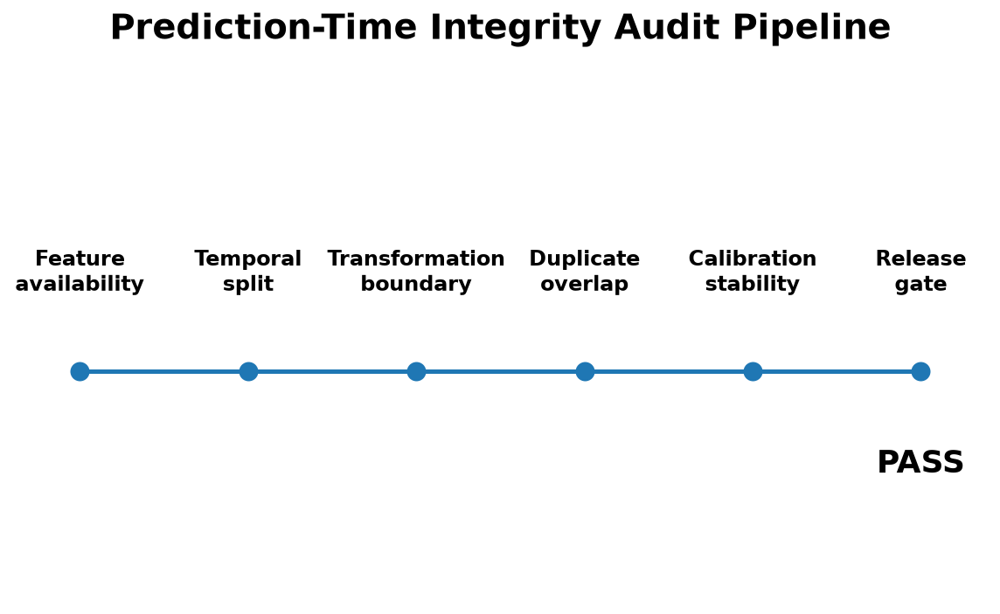
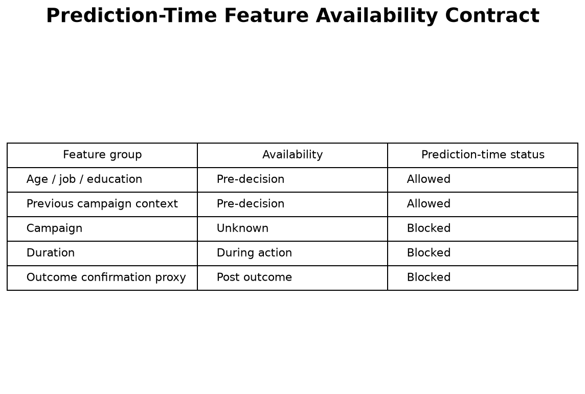
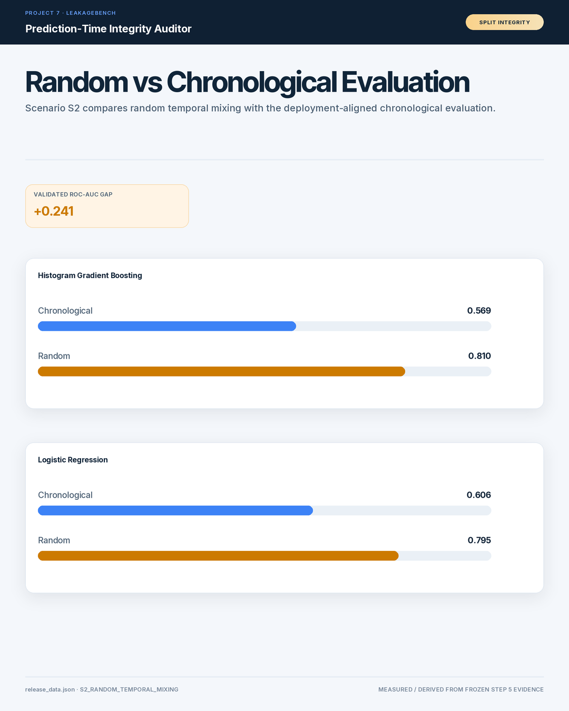
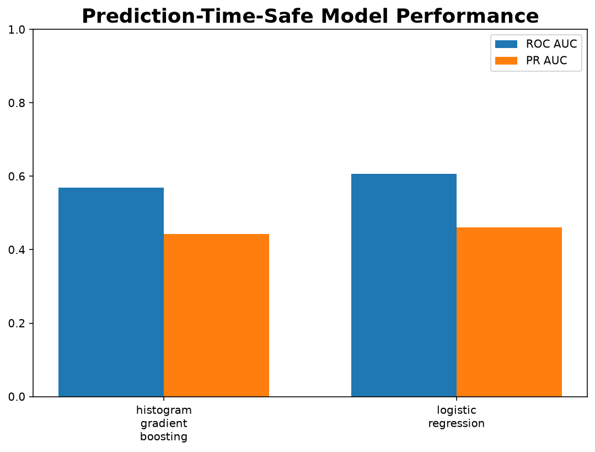
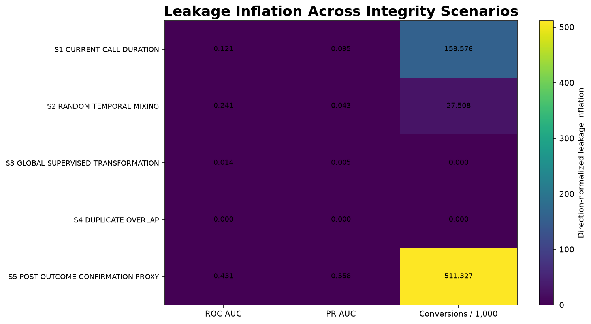
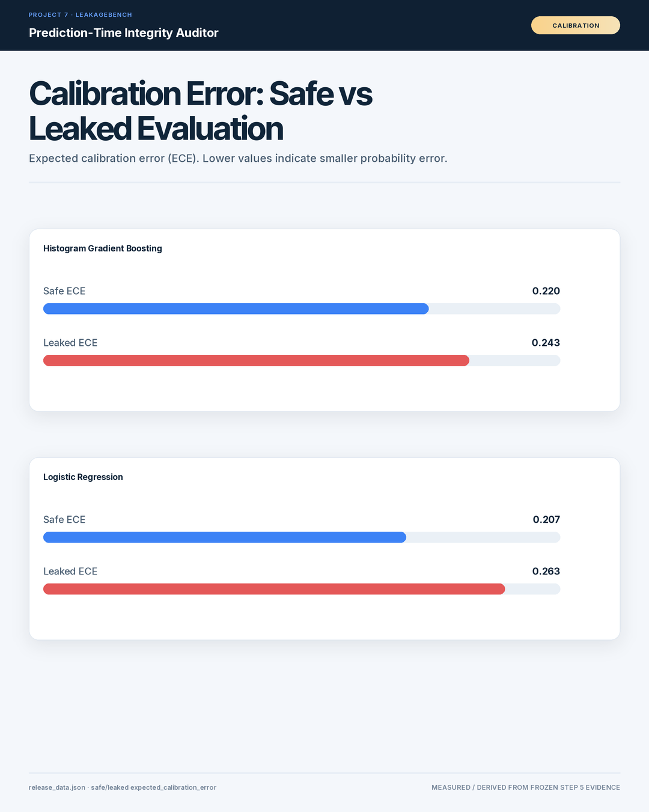
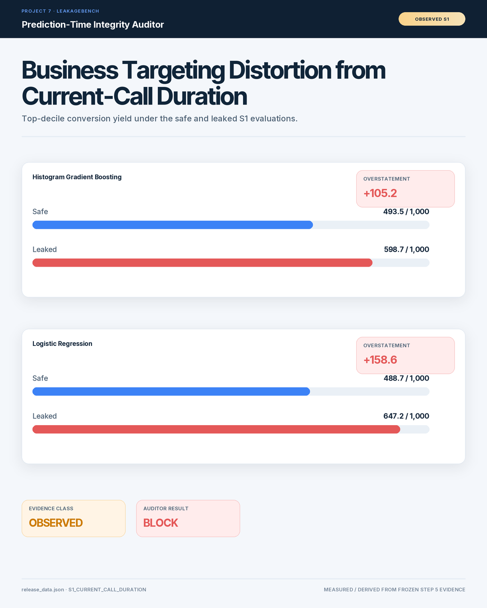

# LeakageBench: Prediction-Time Integrity Auditing for Deployment-Valid Machine Learning Evaluation

**Research identity:** LeakageBench  
**Artifact status:** Internal publication release candidate  
**External publication status:** Locked pending later publication step  
**Author metadata:** Intentionally not assigned in Step 8  
**Peer-review status:** Not peer reviewed  
**Dataset:** UCI Bank Marketing  
**Dataset DOI:** 10.24432/C5K306  
**Dataset license:** CC BY 4.0

---

## Abstract

Offline evaluation can overstate machine-learning performance when features, transformations, records, or evaluation design expose information that will not exist at the production scoring moment. LeakageBench is an applied benchmark and release-control framework for prediction-time integrity. The study defines a fixed pre-decision scoring boundary, classifies model inputs by their deployment-time availability, compares chronological and random evaluation designs, tests multiple leakage mechanisms, and independently reconciles released metric effects before public claims are approved. The goal is not to introduce a new predictive algorithm; it is to separate model performance from information leakage and to make the evidence behind a pass, warning, or block decision auditable. The resulting case study demonstrates how deployment-valid evaluation, feature contracts, reproducible evidence, and claim governance can be joined into one machine-learning release workflow.

**Keywords:** prediction-time integrity, data leakage, machine-learning evaluation, temporal validation, model governance, deployment validation, reproducibility, feature availability

---

## 1. Introduction

Predictive systems are commonly evaluated as though every column in a
training table were equally legitimate at inference time. That assumption
can fail even when the modeling code itself is technically correct. A field
may be observed only after a decision is made, a supervised transformation
may be fitted with information from the evaluation partition, duplicated
records may cross a split boundary, or a random split may hide a temporal
distribution shift.

These failures have a common property: the evaluation procedure allows the
model to observe information that is not part of the production information
set.

LeakageBench treats that mismatch as a release-control problem rather than
only a modeling hygiene issue. The benchmark asks whether a candidate model
is evaluated under the same information constraints that will exist when a
production score is requested.

### 1.1 Research question

The primary research question is:

> Can a machine-learning release process distinguish strong-looking offline
> performance from evidence that remains valid at the actual prediction
> moment?

The project operationalizes that question with an explicit prediction-time
feature contract, temporal evaluation, controlled integrity cases,
independent metric reconciliation, and a machine-readable release decision.

### 1.2 Contribution

LeakageBench is not presented as a new predictive model or optimization
algorithm. Its contribution is a reproducible applied framework connecting:

1. feature availability at the scoring moment;
2. temporal and split integrity;
3. transformation integrity;
4. duplicate-overlap detection;
5. leakage-sensitive model and business metrics;
6. independent reconciliation;
7. public-claim governance; and
8. release-gate decisions.

---

## 2. Prediction-Time Contract

The benchmark freezes the prediction moment as:

> **Immediately before the current outbound call begins.**

All candidate features are evaluated relative to this boundary.

The availability taxonomy is:

- **PRE_DECISION** ? available before the scoring decision;
- **KNOWN_AT_DECISION** ? known when the score is requested;
- **DURING_ACTION** ? produced during the action being predicted;
- **POST_OUTCOME** ? available only after the relevant outcome;
- **UNKNOWN** ? production semantics are not sufficiently documented.

DURING_ACTION, POST_OUTCOME, and UNKNOWN fields are excluded from the
prediction-time-safe release candidate.

This policy intentionally treats uncertainty conservatively. An unclear field
is not silently assumed to be safe simply because it appears in the source
table.

---

## 3. Benchmark Design

### 3.1 Dataset provenance

The benchmark uses the UCI Bank Marketing dataset.

Repository identifier: **UCI dataset 222**  
Dataset DOI: **10.24432/C5K306**  
Dataset archive SHA256:
`e0bf5f5de5b846e2f18e9d90606637267d46dfa260e0f17bb12e605db5efbeb4`

Dataset CSV SHA256:
`74adfc578bf77a7ff4bb1ba4a9f8709d9e3c6907342959c2c8416847e0afb4d8`

Dataset fingerprint:
`316aab7ad11871514b8ac4d0981c971b3412b82e4ead5f9e4298b7017e6b9a32`

These identifiers are included for reproducibility rather than as claims of
external validation.

### 3.2 Evaluation splits

The primary benchmark uses chronological source order with a fixed
70/15/15 train/validation/test design.

A random split is retained as a comparison condition rather than treated as
the default release estimate.

### 3.3 Models

The benchmark intentionally fixes two model families:

- Logistic Regression
- Histogram Gradient Boosting

No AutoML, neural-network search, XGBoost, LightGBM, CatBoost, or broad model
selection procedure is used. This keeps the study focused on information
integrity rather than hyperparameter or model-family competition.

### 3.4 Leakage and integrity cases

The V1 benchmark includes five cases:

1. current-call duration;
2. random temporal mixing;
3. global supervised transformation;
4. duplicate overlap; and
5. post-outcome confirmation proxy.

The cases intentionally mix observed dataset conditions, evaluation-design
experiments, and controlled integrity injections. Their evidence classes must
therefore remain distinct when results are interpreted.

### 3.5 Metrics

The benchmark retains ranking, probability, calibration, targeting, and
release-oriented measures. These include ROC AUC, PR AUC, Brier score,
expected calibration error, targeting lift, conversions per 1,000 contacts,
false-positive contacts, temporal performance gaps, feature-removal effects,
duplicate overlap, and calibration parameters where appropriate.

Project-defined metrics include the Leakage Inflation Index and Campaign
Yield Overstatement. They describe distortion relative to a prediction-time
safe benchmark; they are not standardized external metrics.

### 3.6 Release gate

A candidate is not approved solely because a model metric exceeds a chosen
threshold. The release process also evaluates feature timing, split
integrity, transformation integrity, duplicate overlap, evidence
reconciliation, and claim provenance.

---

## 4. Released Results

The Results section is intentionally generated from the frozen approved
public-claim register. No preview-only or unsupported claim is promoted into
this section.

| Claim | Evidence class | Approved public statement | Released value | Caveat |
|---|---|---|---:|---|
| P7-C001 | MEASURED | Prediction-time-safe Pipeline C passed the Step 4 release gate. | ? |  |
| P7-C002 | MEASURED | The source dataset contains the current-call duration condition evaluated in scenario S1. | ? |  |
| P7-C003 | DERIVED | Random-versus-temporal evaluation produces a measurable ROC-AUC gap. | 0.24119243646906585 |  |
| P7-C004 | DERIVED | Random-versus-temporal evaluation produces a measurable PR-AUC gap. | 0.042921488063624835 |  |
| P7-C005 | CONTROLLED_INJECTION | Scenario S3 is a controlled global supervised transformation integrity violation. | ? |  |
| P7-C006 | CONTROLLED_INJECTION | Scenario S4 is a controlled duplicate-overlap integrity violation. | 618 |  |
| P7-C007 | CONTROLLED_INJECTION | Scenario S5 is a controlled post-outcome confirmation-proxy integrity violation. | ? |  |
| P7-C008 | DERIVED | All reported Step 3 model-level metric effects reconcile independently from safe and leaked metrics. | True |  |

### 4.1 Result interpretation

The central interpretation is that model performance and model validity are
different questions. A metric can be numerically attractive while still
being invalid for deployment if it depends on an impossible information
state.

Conversely, a corrected prediction-time-safe candidate can remain eligible
for release even when its deployment-valid performance is lower than an
integrity-violating comparison.

---

## 5. Research Figures

### Figure 1. Prediction-time integrity audit pipeline

**Caption.** End-to-end integrity workflow connecting prediction-time feature availability, split checks, transformation integrity, duplicate checks, evidence reconciliation, and release decision.

**Evidence note.** Project-generated research figure derived from the frozen benchmark release artifacts. The publication layer does not recompute benchmark business logic.
### Figure 2. Prediction-time feature availability contract

**Caption.** Feature-level availability classification relative to the frozen pre-call prediction moment.

**Evidence note.** Project-generated research figure derived from the frozen benchmark release artifacts. The publication layer does not recompute benchmark business logic.
### Figure 3. Random and chronological evaluation comparison

**Caption.** Comparison of evaluation designs used to test whether temporal mixing changes the benchmark answer.

**Evidence note.** Project-generated research figure derived from the frozen benchmark release artifacts. The publication layer does not recompute benchmark business logic.
### Figure 4. Deployment-valid and leakage-condition performance

**Caption.** Model-performance comparison between the prediction-time-safe benchmark and selected integrity-violating conditions.

**Evidence note.** Project-generated research figure derived from the frozen benchmark release artifacts. The publication layer does not recompute benchmark business logic.
### Figure 5. Leakage inflation map

**Caption.** Summary of the benchmark leakage cases and their measured or controlled integrity effects.

**Evidence note.** Project-generated research figure derived from the frozen benchmark release artifacts. The publication layer does not recompute benchmark business logic.
### Figure 6. Calibration comparison

**Caption.** Calibration evidence retained alongside ranking metrics so the release decision is not based on ROC AUC alone.

**Evidence note.** Project-generated research figure derived from the frozen benchmark release artifacts. The publication layer does not recompute benchmark business logic.
### Figure 7. Business targeting distortion

**Caption.** Translation of evaluation distortion into downstream targeting and campaign-planning implications.

**Evidence note.** Project-generated research figure derived from the frozen benchmark release artifacts. The publication layer does not recompute benchmark business logic.

---

## 6. Discussion

### 6.1 Prediction-time integrity as an interface contract

Feature validity is determined by the operational scoring workflow rather
than by a feature name alone. Explicit availability classes create a
contract between analytics, data engineering, serving infrastructure, and
model governance.

This allows a field to be reviewed before deployment instead of relying on
post-hoc leakage investigations.

### 6.2 Evaluation design is part of the model

A production candidate is more than fitted parameters. The effective model
also includes its feature set, preprocessing behavior, evaluation design,
training/evaluation record boundaries, and scoring-time assumptions.

Treating those elements as release artifacts makes hidden information paths
auditable.

### 6.3 Business implications

Leakage is not only a statistical concern. Inflated ranking or probability
quality can propagate into targeting volumes, staffing assumptions,
prioritization, revenue expectations, and campaign-return estimates.

For that reason, LeakageBench retains business-facing targeting measures
alongside conventional model metrics.

### 6.4 Claim governance

A technically correct experiment can still become misleading during public
communication. The project therefore separates measured evidence, derived
metrics, controlled injections, interpretation, limitations, and unsupported
or preview-only statements.

Only claims explicitly approved in the frozen claim register are promoted
into the released Results section.

---

## 7. Limitations

This benchmark has several important limitations.

First, it is an applied case study based on one public dataset and one frozen
prediction moment. The feature contract should not be assumed to transfer
unchanged to another product, population, or operational workflow.

Second, controlled leakage injections validate auditor behavior; they do not
estimate how frequently those failures occur in real production systems.

Third, the project evaluates two fixed model families. It does not establish
that those models are optimal for the dataset.

Fourth, internal reconciliation verifies consistency of the frozen release
artifacts. It is not an independent external replication study.

Fifth, the manuscript has not been peer reviewed and should not be described
as peer-reviewed scholarship unless a later external review process actually
occurs.

---

## 8. Reproducibility and Evidence Provenance

The publication layer consumes frozen Step 5 release tables and the frozen
claim register. It does not silently recreate benchmark business logic.

The publication bundle retains:

- release-data fingerprints;
- dataset and archive hashes;
- approved-claim traceability;
- figure provenance;
- the prediction-time feature contract;
- independent reconciliation results; and
- a machine-readable publication manifest.

The Step 5 release fingerprint is:

`7954203abe1cb0f5457c3658f2105cd16a0800528e81723ee970d259afe60ed0`

The frozen safe release decision is:

`PASS`

These values are included as release provenance. Public performance claims
remain governed by the approved claim register.

---

## 9. Data Availability

The benchmark is based on the UCI Bank Marketing dataset, identified by
dataset DOI **10.24432/C5K306**.

Users of the dataset remain responsible for following the dataset's
applicable license and attribution requirements.

No private employer data is included in this publication bundle.

---

## 10. Code and Artifact Availability

The current Step 8 bundle is an internal publication release candidate.

External repository publication, archival deposition, DOI registration,
preprint submission, journal submission, and public distribution are outside
the scope of Step 8 and remain locked until the later external-publication
workflow.

---

## 11. Responsible Communication Statement

The benchmark distinguishes empirical results from interpretation and
controlled integrity experiments.

The manuscript must not be used to imply:

- peer review that has not occurred;
- independent external replication that has not occurred;
- production performance for populations not studied;
- universal validity of the frozen feature contract; or
- publication venue, DOI, authorship metadata, or external acceptance that
  has not actually been established.

---

## 12. Conclusion

LeakageBench frames data leakage as a deployment-integrity problem rather
than a narrow preprocessing mistake.

By freezing the prediction moment, explicitly classifying feature
availability, testing multiple information-boundary failures, reconciling
released effects, and governing publication claims, the workflow creates a
traceable connection between offline experimentation and production release
decisions.

The broader lesson is straightforward: model accuracy becomes decision
evidence only when the evaluation environment matches what the model can
actually know at deployment.

---

## References

1. UCI Machine Learning Repository. **Bank Marketing**, dataset ID 222.
   DOI: https://doi.org/10.24432/C5K306.

---

## Appendix A ? Approved Public-Claim Traceability

The authoritative machine-readable traceability table is distributed with
this manuscript as:

`leakagebench_claim_traceability.csv`

Only claims marked `approved_for_public_use = true` are included in the
released Results table.

---

## Appendix B ? Publication Status

**Manuscript status:** Internal release candidate  
**Author metadata:** Not yet assigned  
**Publication venue:** Not selected  
**Manuscript DOI:** Not assigned  
**Manuscript license:** Not selected  
**Peer review:** Not performed  
**External publication:** Locked pending later workflow
